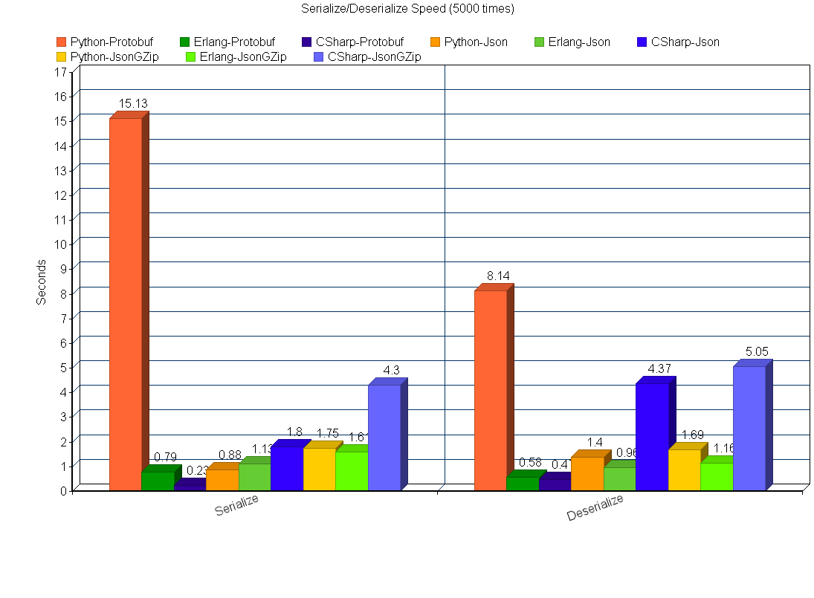

# Json VS Protobuf

## 测试方式
*   Protobuf
*   Json
*   Json with GZip

## 测试基准:
*   序列化后数据大小
*   序列化速度
*   反序列化速度


## 测试结果

```
以 CSharp 为例，不同Logs数量对消息大小的影响
+----------+-----------+--------------------+--------+----------------+
|  Logs    |  Protobuf | Protobuf with GZip |  Json  | Json with GZip |
+----------+-----------+--------------------+--------+----------------+
|    0     |   60      |        81          |  101   |      109       |
+----------+-----------+--------------------+--------+----------------+
|    10    |   350     |        179         |  762   |      222       |
+----------+-----------+--------------------+--------+----------------+
|    50    |   1550    |        438         |  3482  |      500       |
+----------+-----------+--------------------+--------+----------------+
|    100   |   3050    |        729         |  6882  |      843       |
+----------+-----------+--------------------+--------+----------------+


100个logs， 序列化5000次所需时间（秒）. 越小越好
+----------+-----------+--------+----------------+
| Language |  Protobuf |  Json  | Json with GZip |
+----------+-----------+--------+----------------+
| Python   |   15.13   |  0.88  |      1.75      |
+----------+-----------+--------+----------------+
| Erlang   |   0.79    |  1.13  |      1.61      |
+----------+-----------+--------+----------------+
| CSharp   |   0.23    |  1.80  |      4.30      |
+----------+-----------+--------+----------------+


100个logs， 反序列化5000次所需时间（秒）. 越小越好
+----------+-----------+--------+----------------+
| Language |  Protobuf |  Json  | Json with GZip |
+----------+-----------+--------+----------------+
| Python   |   8.14    |  1.40  |      1.69      |
+----------+-----------+--------+----------------+
| Erlang   |   0.58    |  0.96  |      1.16      |
+----------+-----------+--------+----------------+
| CSharp   |   0.47    |  4.37  |      5.05      |
+----------+-----------+--------+----------------+

```




## 结论

*   由于CSharp语言自身的高效率，再加上预生成代码的protobuf方式。
    
    CSharp + Protobuf 是序列化/反序列化速度最快的
*   Google官方的python protobuf库 效率低到无法形容的地步
*   Erlang的表现非常不错，并没有比CSharp慢太多，而且在json的处理上还领先于CSharp
*   Python做服务器，如果对效率要求很高，那么还是找其他的替换官方的protobuf 库
*   Erlang做服务器，Protobuf/Json都是不错的选择。


## 说明

*   `protocol.proto` 是用来测试的 protobuf 描述文件
*   `data.pb` 是 数据通过 protobuf 序列化后的文件
*   `data.json` 是 数据通过 json 序列化后的文件
*   `data.json.gz` 是数据通过 json 序列号后，并且用 gzip 压缩后的文件
*   gzip  压缩等级为6
*   序列化测试需要两个参数
    *   LOG AMOUNT: 通过不同logs数量来模拟不同大小的数据
    *   BENCHMARK TIMES： 序列化次数
*   反序列化需要一个参数
    *   BENCHMARK TIMES： 反序列化次数
*   输出的时间单位为秒

上面三个data开头的文件，正是反序列化所需的数据来源。（100个logs）

（文件读取是在测试开始以前就完成的，不会有频繁的IO影响测试结果）.


#### Python

*   使用google官方的 protoc 生成 对应的python文件
*   Python 使用的库是 protobuf==2.5.0
*   使用内置json库
*   序列化测试: `./pack.py [LOG AMOUNT] [BENCHMARK TIMES]`


    ```
    ./pack.py 100 100
    LogAmount =  100
    Protobuf Size     : 3050
    Json Size         : 7707
    Json GZip Size    : 898

    Benchmark Times = 100
    Protobuf Seconds  : 0.309223890305
    Json Seconds      : 0.0185949802399
    Json GZip Seconds : 0.0442588329315
    ```
    
*    反序列化测试: `./unpack.py [BENCHMARK TIMES]`

    ```
    ./unpack.py 100
    Benchmark Times = 100
    Protobuf Seconds  : 0.162999868393
    Json Seconds      : 0.0300300121307
    Json GZip Seconds : 0.0367920398712

    ```

#### Erlang
*   使用 [gpb][1] 作为从 .proto 文件生成 erlang 文件的工具
*   使用 [jiffy][10] 所为 json 库
*   序列化测试: `./benchmark pack   [LOG AMOUNT] [BENCHMARK TIMES]`

    ```
    ./benchmark pack 100 100
    LogAmount = 100
    Protobuf Size     : 3050
    Json Size         : 6882
    Json Gzip Size    : 868

    BenchmarkTimes = 100
    Protobuf Seconds  : 0.018345
    Json Seconds      : 0.023872
    Json Gzip Seconds : 0.033556

    ```
*   反序列化测试: `./benchmark unpack [BENCHMARK TIMES]`

    ```
    ./benchmark unpack 100
    BenchmarkTimes = 100
    Protobuf Seconds  : 0.013519
    Json Seconds      : 0.021982
    Json Gzip Seconds : 0.024749

    ```

#### CSharp
*   使用 [pg][2] 来生成对用的dll

    [pg][2] 是我的一个小工具，基于 [ProtoGen][3]，并且使用了 [precompile][4] 技术。
    [pg][2] 基于 [mono][5] 平台，所以可以在 Windows, Linux, MacOS 上使用。

*   使用 [LitJson][6] 作为Json库
*   Json直接使用的 `LitJson.JsonData`，没有预先写Class来序列化/反序列化。不知道对速度有什么影响。
*   使用 [SharpZipLib][7] 作为GZip 压缩/解压缩工具
*   序列化: `make pack.exe && ./pack.exe [LOG AMOUNT] [BENCHMARK TIMES]`
    ```
    ./pack.exe 100 100
    LogAmount = 100
    Protobuf Size         : 3050
    Json Size             : 6882
    Json GZip Size        : 843

    Benchmark Times = 100
    Protobuf Seconds      : 0.004
    Json Seconds          : 0.04
    Json GZip Seconds     : 0.088

    ```
*   反序列化: `make unpack.exe && ./unpack.exe [BENCHMARK TIMES]`
    ```
    ./unpack.exe 100
    Benchmark Times = 100
    Protobuf Seconds  : 0.025
    Json Seconds      : 0.104
    Json GZip Seconds : 0.107

    ```


[1]: https://github.com/tomas-abrahamsson/gpb
[2]: https://github.com/yueyoum/pg
[3]: https://code.google.com/p/protobuf-csharp-port/wiki/ProtoGen
[4]: http://game.ceeger.com/forum/read.php?tid=13479
[5]: http://www.mono-project.com/
[6]: https://github.com/lbv/litjson
[7]: https://github.com/icsharpcode/SharpZipLib
[10]: https://github.com/davisp/jiffy

 

